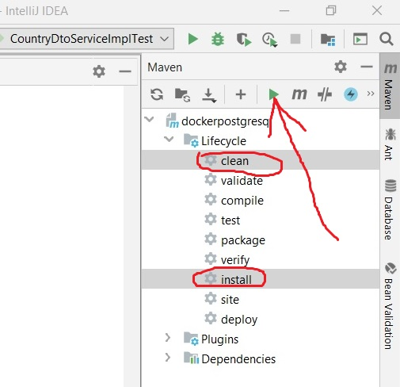
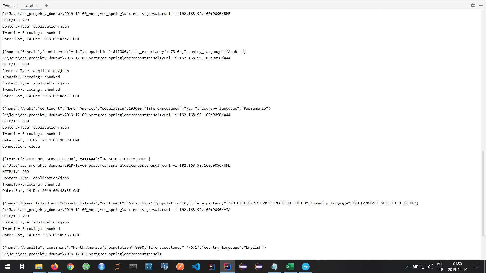

# The-World-Is-Enough, or how to prepare a RESTful service by means of _the (PostgreSQL) World database_ and Docker

Contrary to the James Bond's claim that _the world is not enough_, 
I may assure the reader that [the world database](https://github.com/ghusta/docker-postgres-world-db)
is quite enough to prepare a nice RESTful service. Here's the recipe:
<ul>
<li>
At your personal Docker (e.g. Docker CLI) execute: 

`docker pull ghusta/postgres-world-db` 
</li>
<li>
Next, execute: 

`docker run --name postgre-world -e POSTGRES_PASSWORD=world123 -d -p 5432:5432 ghusta/postgres-world-db`
</li>
<li>
Clone this repository and build a Spring Boot Docker application with OpenJDK8,
by chosing "clean" and "install" during the process of building
the application, as it is shown at the picture:

 
</li>
<li>
Execute: 

`docker build . -t joajar-postgre` 
</li>
<li>
Execute: 

`docker run -p 9090:9090 --name joajar-postgre --link postgre-world -d joajar-postgre` 
</li>
<li>
Now, finally, you may get data from the world database.
Some examples are shown below:

 
</li>
</ul>

DISCLAIMER: Just in case my repository contains _all_ the files produced on the occasion of producing the service,
contrary to the good habit of removing some of them.
